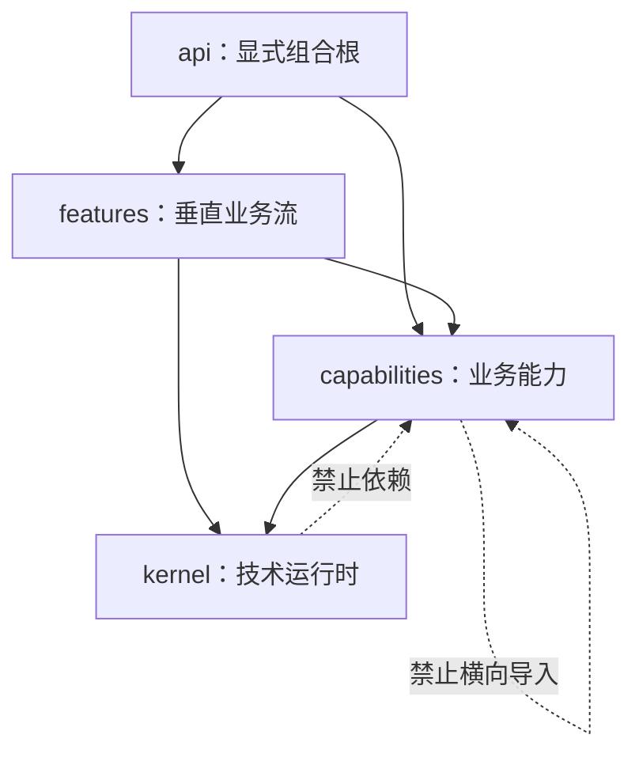

# aiya-cms 全盘重构计划书

> 状态：已接受；R1 规格重写已落入 `context/spec/`，后续从 R0 归档与 R2 实现清理继续  
> 适用范围：当前本地 Demo，可删除数据库、迁移历史、后端实现和管理员端 API 绑定后重建  
> 文档性质：一次性施工计划，不是长期规格；重构完成后由新版 `context/spec/` 继续作为唯一事实来源

## 1. 结论

本次不在现有 `kernel + modules + api` 上继续修补，而是重建为四层：

1. `kernel`：只提供数据库、事务、事件可靠投递、任务与工作流运行时、配置、日志、错误、时间和诊断等技术机制。
2. `capabilities`：承载 identity、access、OIDC Provider、audit、content、taxonomy、points、notification 等可独立启用的业务能力。
3. `features`：用一个垂直业务文件编排多个能力，描述完整业务流。
4. `api`：唯一组合根，显式选择能力、功能、适配器和端点，并在启动时校验与冻结。

不采纳“把所有业务抽象都放入 kernel”的方案。抽象如果带有用户、内容、积分、邮件等业务词汇，就仍然是业务能力；放进 kernel 只会把当前耦合改名后继续冻结。kernel 只保留不理解业务含义的运行机制。

不建设万能 CRUD 业务层。kernel 提供 Repository/UoW、分页和查询规格等 IO 原语；每个能力公开有语义的 Command/Query，例如 `ScheduleContent`、`CreditPoints`、`RegisterOidcClient`，避免权限、审计、幂等和状态机被通用 CRUD 绕过。

## 2. 已确认前提

- 当前项目是本地 Demo，没有生产数据和外部兼容义务。
- 不迁移 WordPress 数据，不设计 WordPress 兼容层。
- 可以删除现有 Alembic revision，最终生成一个新的初始基线。
- 系统是 OIDC Provider，向其他应用提供登录；不是以接入外部 OIDC 为主。
- content 支持定时发布、置顶、单向引用和平面多维标签。
- page 只是一个内容类型声明，不注册分类维度。
- 不实现父子页面、父子分类、修订、媒体库。
- 文件由外部图床或 S3 类服务承载，系统只保存稳定对象引用并调用 SDK。
- SEO 的站点级默认值进入 settings；单页 SEO 组合和渲染由前端负责。
- 删除 interaction 和当前 dashboard 测试实现。
- 每个能力提供只读诊断、指标和可选读模型，由 API 显式汇总。
- 业务流需要在一个垂直文件中可完整阅读，但每一步必须可独立提交、重试和恢复。

## 3. 目标与非目标

### 3.1 目标

- 新业务只需新增或修改一个 capability/feature 包，不修改 kernel。
- 未装配的能力不注册路由、事件、定时任务或后台 worker，也不产生运行时副作用。
- 所有注册均显式、可枚举、可校验；禁止 import side effect 和自动扫描。
- 写路径具备事务边界、幂等、可靠事件投递和崩溃恢复能力。
- 能力之间不互相导入，跨能力流程集中到 `features`。
- OpenAPI 继续作为前后端唯一 HTTP 契约来源。
- OIDC、积分账本、定时发布等高风险能力具有独立安全与并发验收门。
- 重建后只有一套规格、一套初始迁移和一套可重复 Compose 验收流程。

### 3.2 非目标

- WordPress 插件生态或 WordPress 数据结构兼容。
- 动态安装第三方 Python 插件、entry-point 自动发现或运行时热加载。
- 将每张表自动暴露为 HTTP CRUD。
- 在一次数据库事务内完成邮件、关键词服务、发布和积分等长流程。
- OIDC 首版支持 implicit、hybrid、password grant、动态客户端注册、Federation 或 FAPI。
- 内建对象存储、图片处理、媒体库、内容修订和层级导航。
- 在本次重构中保留旧 API、旧迁移或旧数据库的升级路径。

## 4. 目标目录与依赖方向

```text
inc/
  kernel/
    boot/                 # manifest、registry、freeze、fail-fast
    config/
    db/                   # Base、Repository 原语、UoW、分页、迁移协议
    events/               # durable outbox/inbox、dispatcher
    workflow/             # workflow、activity、signal、retry、compensation
    tasks/                # worker、lease、cron 触发器
    observability/        # logging、metrics、diagnostic contracts
    errors/
    security/             # 无业务身份含义的密码学/随机数/密钥原语
    time/
  capabilities/
    identity/
    access/
    oidc_provider/
    audit/
    settings/
    notification/
    content/
    taxonomy/
    assets/
    points/
    payments/
  features/
    post/
      definition.py
      workflows/
      api.py
    page/
      definition.py
      workflows/
      api.py
    check_in/
    point_purchase/
  api/
    app.py
    container.py
    manifest.py
    http/
    openapi.py
```



依赖规则：

- `kernel` 不得导入 `capabilities`、`features`、`api`。
- capability 只能导入 kernel 和自身；不得导入兄弟 capability。
- feature 可以导入多个 capability 的公开 Port/DTO/Command，但不得读取它们的 ORM、Repository 或内部模块。
- `api` 是唯一构建容器、选择实现、挂载 router、启动 worker 和冻结 registry 的位置。
- 适配器实现放在提供方 capability 或 `api/adapters`，接口放在消费方，防止 provider 反向控制业务。
- 所有包的 `__init__.py` 均无注册、连接数据库、启动线程或创建全局单例等副作用。

## 5. 装配和“未调用不工作”契约

每个 capability/feature 导出纯数据声明，不在导入时执行注册：

```python
CapabilitySpec(
    name="content",
    tables=(...),
    commands=(...),
    queries=(...),
    events=(...),
    activities=(...),
    diagnostics=(...),
    routers=(...),
)
```

组合根按固定顺序处理：

1. 读取静态 `AppManifest`。
2. 创建 container-local registries，不使用进程级可变全局 registry。
3. 注册 technical providers。
4. 注册 capabilities。
5. 注册 features 和它们的工作流。
6. 解析所有 Port 与 adapter。
7. 校验重复 key、缺失依赖、事件 schema、任务版本和 capability 权限。
8. 挂载显式 router。
9. freeze。
10. 最后启动 dispatcher、scheduler 和 worker。

“未启用”定义为：没有 router、订阅、cron、worker、外部连接或后台协程。迁移是否创建该能力的表与运行时启用是两个概念；首版建议所有随发行版交付的表均迁移，运行行为仍按 manifest 启用，以避免按部署组合生成不可预测的数据库历史。

## 6. kernel 设计

### 6.1 保留的技术原语

- SQLAlchemy `Base`、Repository 基类、Unit of Work、分页和声明式查询条件。
- UTC 时间、UUID、序列化、Pydantic JSONB 绑定。
- 结构化错误、request/trace ID、日志和通用审计信封。
- durable outbox/inbox；业务事件和数据库状态在同一事务提交。
- worker lease、重试退避、死信、取消、超时和 shutdown drain。
- workflow/activity/signal 状态机和幂等执行记录。
- cache Port；具体 Redis/in-memory adapter 由组合根选择。
- diagnostics/metrics/readmodel 的接口与聚合协议。
- 通用密码学、签名、随机数和 key loading 原语；OIDC 语义不放在 kernel。

### 6.2 从 kernel 移出的现有组件

- `identity`、`auth`、`rbac` 移到 identity/access/OIDC capabilities。
- `content`、`taxonomy`、`comment` 移到相应 capabilities；comment 暂不进入首个重建闭环。
- `mail` 改为 notification capability，kernel 只保留可靠 activity/outbox 机制。
- `settings` 移为 capability。
- `audit` 拆为 kernel 的技术审计信封和 access/feature 定义的业务审计事件。
- 当前业务化的 pipeline 改为 feature workflow；只保留必要的 command middleware，不继续发展全局钩子系统。

### 6.3 明确禁止

- kernel 中出现 `User`、`Content`、`Points`、`Mail`、`Role` 等领域模型。
- Service 接收 SQLAlchemy Session，或跨能力直接写表。
- 裸 SQL 和无 Pydantic 模型的 JSONB。
- 读请求触发写库、发事件或隐式统计。
- 用继承层级表达业务步骤；优先组合、Protocol 和小型 activity。
- 用一个抽象 `GenericCrudService` 承担全部业务写入。

## 7. capability 统一规格

每个 capability 必须拥有并只维护自己的：

- `models.py`：表结构和约束。
- `schemas.py`：公开 DTO 和 JSONB 模型。
- `commands.py` / `queries.py`：有业务语义的入口。
- `ports.py`：自身消费的外部能力接口。
- `events.py`：版本化事件 schema。
- `activities.py`：可被工作流调用的幂等步骤。
- `diagnostics.py`：只读一致性探针，不修复数据。
- `metrics.py`：低成本运行指标。
- `readmodels.py`：可选的中台统计投影。
- `definition.py`：纯声明的 `CapabilitySpec`。
- `migrations/`：该能力未来的迁移所有权。
- `tests/`：能力合同、并发、幂等和表所有权测试。

迁移由 capability 持有，根 Alembic 环境通过显式 migration manifest 汇总。所有 revision 使用全局唯一 ID 和确定性依赖；发布门要求只有一个可部署 head。重构期间允许临时 revision，首次发布前统一 squash 为 `0001_initial`，此后恢复正常向前兼容迁移，不再反复改写历史。

## 8. 核心能力计划

### 8.1 Identity、Access 与 OIDC Provider

拆为三个边界：

- identity：用户、登录身份、凭据状态、账号生命周期。
- access：角色、能力、授权决策、管理员权限和 consent 决策。
- oidc_provider：客户端、authorization code、token、refresh family、session、scope、claim、JWKS 和协议端点。

首版协议范围：

- Authorization Code Flow + PKCE；public client 强制 `S256`。
- Discovery、Authorization、Token、UserInfo、JWKS、Revocation。
- 静态客户端注册和精确 redirect URI 匹配。
- `state`、`nonce`、issuer、audience、授权码一次性消费和短时有效。
- 非对称签名密钥、`kid`、轮换窗口和旧公钥保留期。
- refresh token rotation、reuse detection、token family revoke。
- RP-Initiated Logout、会话撤销、scope/claim/consent 最小模型。
- 审计登录、授权、发 token、撤销、密钥轮换和异常重用。

首版不含 implicit/hybrid、password grant、动态客户端注册、Federation 和 FAPI。协议安全基线采用 OIDC Core、Discovery、RFC 9700、RFC 7636、RFC 7009 和 RP-Initiated Logout；以 OpenID Foundation conformance suite 的 Basic OP、Config OP、Logout OP 作为发布门。

管理员 SPA 作为第一个 first-party public client 使用 Authorization Code + PKCE，避免另建一套长期分叉的浏览器认证协议。若需要把 refresh token 留在 httpOnly Cookie，则由独立 BFF/会话适配器承担，不能混入 OIDC Provider 的公共 token 端点语义。

### 8.2 Content 与 Taxonomy

content capability 提供通用实体、状态机、类型声明和有语义的 commands；post/page 由 feature 注册实际类型。

首版状态至少包含：

```text
draft -> pending -> scheduled -> published
          |             |
          +-----------> rejected/cancelled
published -> archived
```

定时发布要求：

- content 保存 `publish_at`、`schedule_version` 和当前状态。
- scheduler 只负责扫描到期项并启动 `PublishScheduledContent` workflow。
- 领取到期项使用 lease 或 `FOR UPDATE SKIP LOCKED`，支持多 worker。
- 状态变化和 outbox 事件同事务提交。
- 幂等键为 `content_id + schedule_version`。
- 进程重启后重新扫描，不依赖内存 timer。

置顶采用查询期排序：`is_pinned DESC, pin_rank DESC, published_at DESC, id DESC`。count 使用同一过滤条件但不参与排序，`total` 仍表示符合过滤条件的全部记录；置顶项占用当前页容量，不另造会破坏分页语义的重复结果。

taxonomy 使用平面多维标签：

- `dimensions` 定义维度、是否多选、最大选择数和查询组合规则。
- `terms` 属于一个 dimension，不含 parent。
- `content_terms` 关联内容和 term。
- category 只是单选或限选的 dimension，不再有独立层级模型。
- page 类型不声明任何 taxonomy dimension。

内容引用使用独立 `content_references(source_id, target_id, kind, position)`，只做单向独立查询，不递归加载。默认删除策略为禁止物理删除被引用内容，先归档或显式解除引用；不做级联删除。

### 8.3 Assets 与 SEO Settings

assets capability 不接管二进制数据，只保存稳定引用：provider、bucket、object key、mime、size、checksum、alt 和可选 metadata。禁止持久化带过期签名的 URL；读取时通过 provider adapter 生成 URL。

settings 增加 `seo` group，至少覆盖站点名称、默认标题模板、默认描述、默认分享图、robots 和 canonical host。后端只返回结构化设置和内容基础字段，不感知前端路由。单页 title/description/canonical/Open Graph/JSON-LD 的选取与渲染由前端约定完成。

### 8.4 Notification

notification 表达通知意图、模板、收件目标、channel 和 delivery 状态；Email、SMS 等是可替换 adapter，而不是继承一个不断扩大的 MailService。

- feature 调用 `SendNotification` activity 或发布显式通知请求。
- provider adapter 负责 SDK、认证、限流和错误映射。
- delivery 使用幂等键、重试和死信。
- 模板渲染与 provider 发送分离。
- 未装配某 channel 时启动校验失败，不静默丢弃。

### 8.5 Points 与 Payments

积分作为一级 capability，但不进入 kernel。其公开面保持稳定，具体奖励规则由 feature 注册。

核心表：

- `point_programs`：积分计划/币种定义。
- `point_accounts`：用户与积分计划的账户关联。
- `point_ledger_entries`：不可变流水，含 signed amount、behavior code、source、idempotency key、actor、metadata 和 reversal link。
- `point_balances`：可选的事务内余额快照，流水仍是事实来源。
- `point_behavior_specs`：代码注册的行为规格，不把可执行逻辑存入数据库。

只公开 `CreditPoints`、`DebitPoints`、`ReverseEntry`、`GetBalance`、`ListLedger` 和管理员审计调整；禁止直接修改余额。扣减使用原子条件更新或账户行锁，必须通过并发超扣测试。相同幂等键只能产生一条流水。

下游 feature 注册行为 code、方向、上下限、冷却/每日次数和 metadata schema，例如 `post.published.reward`、`daily_check_in.reward`、`purchase.completed.credit`。注册只声明规则，是否触发由垂直 workflow 明确决定，积分能力不自动订阅所有领域事件。

payments 独立于 points：

- 建立订单并记录 provider reference。
- 调用外部支付 SDK。
- webhook 验签、时间窗、重放保护和幂等落库。
- 只有 `PaymentCaptured` 后由 `point_purchase` workflow 记积分流水。
- 退款触发 reversal，不删除原积分流水。

首个支付 provider 在接口、订单状态机和 webhook 合同冻结后选择；不得让某一 SDK 的 payload 渗入 points DTO。

## 9. 垂直业务流

跨能力流程放入 `inc/features/<feature>/workflows/<flow>.py`。一个文件负责声明完整流程、步骤顺序、输入输出、重试、补偿和信号，但不直接操作其他能力的表。

示例结构：

```python
class SubmitPostWorkflow:
    steps = (
        PersistPendingContent,
        NotifyReviewers,
        StartKeywordScan,
        WaitForModerationSignal,
        PublishContent,
        AwardPublishPoints,
    )
```

执行语义：

- `PersistPendingContent` 提交后其他步骤失败也不回滚该记录。
- 外部调用只能出现在 activity 中，每个 activity 有稳定幂等键。
- 等待审核通过使用持久化 signal，不占用线程或数据库事务。
- 关键词扫描、通知和积分可分别重试。
- 发布成功后积分失败时，内容保持已发布，工作流停在可恢复步骤。
- 每一步保存输入版本、尝试次数、错误类别和 trace ID。
- 补偿只用于确实可逆的动作，不能把“发送过邮件”伪装成可回滚。

这样“一处完成代码”指业务编排和规则在一处可阅读，不代表所有 ORM、SDK 和协议实现复制进一个文件。

## 10. 诊断、统计与中台读模型

删除当前 interaction 和直接拼装 service 的 dashboard endpoint。统一约定：

- `diagnostics.py`：只读检查表约束、孤儿记录、状态不一致、积压和关键依赖；不得自动修复。
- `metrics.py`：暴露 counter/gauge/histogram，例如 outbox lag、workflow failures、OIDC token errors。
- `readmodels.py`：为管理员端提供可缓存的聚合投影。
- 修复动作放在单独的显式 Command，并要求权限、审计和 dry-run。

每个启用的 capability 可注册 `DiagnosticProvider`、`MetricProvider`、`AdminSummaryProvider`。API 只遍历已冻结 provider 列表并汇总统一 DTO，不直接查询各能力表。未授权的统计项不返回或返回明确 unavailable 状态，不能以 `null` 混淆无权限、未启用和查询失败。

## 11. API 与管理员端

- capability/feature 可以导出 `RouterSpec`，但只有 `api/manifest.py` 决定是否挂载。
- 不允许 subclass 自动生成 endpoint，也不允许导入模块后自动注册 router。
- HTTP 依赖可收敛为一个 request-scoped `AppContext`，内部只暴露已声明的 Command/Query gateway。
- 后端授权仍是最终边界；前端权限只控制可见性和交互。
- OpenAPI snapshot、hash 和 TypeScript 类型必须随 API 变更同步生成。
- 管理员端只消费生成类型，不手写重复 DTO。

生产环境不使用 Vite development server 或 `vite preview` 承载管理员站点。`admin` 镜像先执行 Vite build，再由 Caddy、Nginx、对象存储/CDN 或受支持的静态文件服务发布。若坚持与 API 分离端口，必须显式设计 origin、CORS、Cookie/CSRF 和 OIDC redirect URI；“不用 Nginx”可以接受，“用 Vite 当生产服务器”不作为发布方案。

## 12. 删除、保留与重写清单

| 范围 | 处理 | 说明 |
| --- | --- | --- |
| `context/spec/*.md` | 全量重写 | 不让旧 kernel 冻结规则与新架构并存 |
| `inc/kernel` 业务包 | 删除后按新边界迁移必要代码 | 不保留旧公开路径兼容层 |
| `inc/modules` | 删除 | 用 `capabilities` 与 `features` 替代 |
| `inc/api/routes.py`/`deps.py`/`wiring.py` | 重写 | 拆为显式 manifest、container 和 router specs |
| interaction | 删除 | 不迁移模型、API 和测试 |
| dashboard endpoint/前端绑定 | 删除 | 以后由 readmodel providers 重建 |
| `alembic/versions/0001...0010` | 删除 | 最终生成新的 `0001_initial` |
| 根 OpenAPI snapshot 和生成 TS | 重新生成 | 不保留旧 endpoint 兼容 |
| 管理员端业务页面 | 按新 OpenAPI 重接 | 保留通用布局、许可证和来源说明 |
| Compose/质量脚本 | 先审计后改写 | 保留可重复容器验收目标 |
| DB/UoW/错误/日志等实现 | 按合同逐项复用 | 复用代码而不是复用旧归属和公开路径 |
| 旧测试 | 保留需求价值，重写实现绑定 | 不用旧测试锁死旧架构 |

执行破坏性删除前创建 Git tag 或归档分支 `demo-before-full-rebuild`。数据库 volume 只在确认目标 Compose project name 和绝对路径后删除；Git 历史是旧 Demo 的恢复入口。

## 13. 规格重写清单

批准本计划后，先原子性重写 `context/spec/`，建议形成：

1. `architecture.md`：四层结构、依赖方向、表所有权和副作用规则。
2. `kernel-runtime.md`：DB/UoW、outbox/inbox、workflow、tasks、observability。
3. `composition.md`：CapabilitySpec、FeatureSpec、manifest、freeze、生命周期。
4. `identity-access-oidc.md`：身份、授权和 OIDC 安全协议。
5. `content-taxonomy.md`：内容状态、定时发布、置顶、标签和引用。
6. `points-payments.md`：账本、行为注册、购买、退款和 webhook。
7. `notification-assets-settings.md`：渠道 adapter、外部资源与 SEO 设置。
8. `http-openapi.md`：端点、错误、分页、授权和契约生成。
9. `admin.md`：管理员端边界、OIDC 登录、生产静态部署。
10. `quality-release.md`：测试矩阵、Compose 和发布门。

旧规格和新规格必须在同一个变更中切换；不维护 ADR、roadmap 或第二份长期事实源。尚未确认的选择先留在本计划的“决策门”，确认后直接写入对应规格。

## 14. 分阶段施工与退出门

### R0：冻结方案与归档 Demo

工作：

- 确认第 15 节决策门。
- 创建 Demo 归档 tag/branch。
- 建立旧文件删除清单和新版规格目录。

退出门：所有破坏性范围可从 Git 恢复；不存在未记录的外部数据依赖。

### R1：规格全量替换

工作：

- 原子重写 `context/spec/`。
- 为每条硬约束定义可自动验证的测试或启动检查。
- 冻结最小术语：kernel、capability、feature、port、adapter、workflow、activity。

退出门：规格内部无矛盾；旧 kernel 公共面不再被声明为兼容目标。

### R2：清空实现并建立架构骨架

工作：

- 删除旧业务实现、旧迁移、旧路由绑定和旧实现耦合测试。
- 建立新目录和最小 import surface。
- 先写失败的 architecture tests。

退出门：测试能阻止反向依赖、兄弟 capability 导入、Session 泄漏、裸 SQL、import 副作用和未声明注册。

### R3：技术 kernel

工作：

- 重建 DB/UoW、errors、config、logging、clock。
- 实现 durable outbox/inbox。
- 实现 task/workflow/activity 状态机、lease、retry、signal 和 shutdown。
- 建立 diagnostics/metrics contracts。

退出门：故障注入证明 commit 后事件不丢、重复投递不重复生效、worker 崩溃可恢复、空 manifest 不启动业务行为。

### R4：Identity、Access、OIDC

工作：

- 完成身份和授权能力。
- 实现 OIDC 首版端点、密钥轮换、token family 和审计。
- 管理员 SPA 先作为 conformance 之外的真实客户端接入。

退出门：安全单元/集成测试全绿；OpenID conformance 目标套件通过；redirect、PKCE、nonce、code replay、refresh reuse 和 logout 有负向测试。

### R5：Content、Taxonomy、Settings、Assets

工作：

- 建立 content 类型注册、状态机和有语义 commands。
- 实现 scheduled publish、query-time pin、平面多维标签和单向引用。
- 注册 post/page；page 不注册 taxonomy。
- 增加 SEO settings 和外部 AssetRef。

退出门：定时发布在重启、重复扫描和并发 worker 下只发布一次；置顶分页稳定；未知类型/维度启动即失败。

### R6：Notification 与垂直工作流合同样例

工作：

- 建立 Email/SMS provider Port 和至少一个开发 adapter。
- 用不进入生产 manifest 的合同 fixture 串联待审入库、通知、异步处理、审核信号和发布，验证垂直工作流能力；该示例不是 post 默认产品行为。
- 建立每步 trace、重试、死信和人工恢复入口。

退出门：在每个步骤前后注入崩溃均可恢复；已完成的外部副作用不会重复。

### R7：Points 与 Payments

工作：

- 实现不可变账本、余额、行为规格注册和并发扣减。
- 实现签到 feature 和发布奖励示例，验证下游注册模式。
- 冻结 payment provider Port 后接入一个外部 SDK sandbox。
- 完成 webhook 验签、支付入账和退款 reversal workflow。

退出门：并发不超扣；所有写入幂等；账本可重算余额；伪造/重放 webhook 被拒绝；退款不删除历史。

### R8：API、管理员端与统计读模型

工作：

- 按 manifest 挂载显式 routers。
- 汇总 capability diagnostics 和 admin readmodels。
- 删除旧 dashboard/interaction UI，按新 OpenAPI 重接核心页面。
- 确定生产静态部署容器。

退出门：无手写重复 DTO；权限负向测试通过；管理员端 build、unit、E2E 全绿；生产镜像不运行 Vite dev/preview server。

### R9：新基线与发布验收

工作：

- squash 临时迁移为单一 `0001_initial`。
- 从空 PostgreSQL 执行 upgrade，验证 schema 与 metadata 一致。
- 生成最终 OpenAPI snapshot、hash 和前端类型。
- 从空 Docker volume 执行 Compose 全链路验收。

退出门：backend/admin 质量门、Alembic、OIDC conformance、真实 Postgres/Redis/通知开发服务、管理员 E2E 全部通过；新版规格与实现无漂移。

## 15. 已采用的实施决策

下列默认值已随本计划获接受并写入新版规格；支付 provider 的具体厂商选择仍留到 R7 前完成。

1. **重建授权**：已确认可全量删除本地 Demo 数据和迁移历史。
2. **能力迁移装配**：所有随发行版交付的 capability 表统一迁移，运行时按 manifest 启用；不做“启用一个模块才动态跑一段迁移”。
3. **OIDC 客户端管理**：首版只支持管理员静态注册；动态注册延后。
4. **管理员端会话**：SPA 使用 Code + PKCE，内存 access token；若要求长期会话，再增加 BFF/httpOnly session adapter。
5. **内容物理删除**：业务 API 只归档；物理 purge 遇到引用时拒绝并要求先解除引用。
6. **置顶分页**：采用全结果排序且占用页容量；如果产品要求“置顶区不占分页”，必须改成 `pinned_items + items + total` 双区响应，不能把两种语义混用。
7. **积分余额**：ledger 为事实来源，balance 为同事务快照；不在每次查询时全量求和。
8. **积分过期**：首版不支持过期；加入过期会显著增加批次、消费顺序和冲正复杂度。
9. **支付 SDK**：需要在 R7 前选定 provider、币种、地区、退款和 webhook 能力；在此之前只冻结 Port。
10. **资源引用**：建立轻量 `assets` 表以支持复用和 provider 切换，但不扩展为媒体库。
11. **评论**：不进入首个闭环，待 OIDC/content/workflow/points 稳定后作为独立 capability 加回。

## 16. 测试矩阵

| 层级 | 必测内容 |
| --- | --- |
| Architecture | 依赖方向、表所有权、public import、Session/裸 SQL/JSONB、import side effect、显式注册 |
| Kernel | UoW、outbox/inbox、lease、retry、shutdown、workflow crash recovery、时钟与错误合同 |
| Capability | DTO、命令权限、事务、并发、幂等、事件 schema、诊断只读性 |
| Feature | 完整流程、信号、步骤重试、不可逆副作用、部分失败和人工恢复 |
| OIDC | 协议正负路径、key rotation、code replay、refresh reuse、redirect/PKCE/nonce/logout、conformance |
| Content | 状态迁移、定时发布、置顶稳定排序、标签维度、引用删除策略 |
| Points/Payment | 原子扣减、重复奖励、冲正、余额重算、webhook 验签/重放/乱序 |
| HTTP/OpenAPI | error/page/auth contract、schema snapshot、生成客户端、未启用端点不存在 |
| Admin | 类型检查、单元测试、OIDC 登录、权限可见性、真实 API E2E、生产 build |
| Compose | 空卷启动、迁移、健康检查、worker、OIDC、发布工作流、积分购买 sandbox |

测试顺序固定为：新版规格 -> 失败测试 -> 最小实现 -> 集成/故障测试 -> OpenAPI/管理员端同步。任何阶段不得先写实现再补规格。

## 17. 风险与控制

- **内部框架过度设计**：先用 post/page/check-in/point-purchase 四个真实 feature 反推抽象；没有第二个用例前不提炼新基类。
- **“未启用”只停在口号**：用空 manifest 和最小 manifest 启动测试证明路由、订阅、cron、线程和外部连接均未产生。
- **工作流变成隐藏全局魔法**：所有 workflow/activity key 静态注册、版本化并能打印注册清单。
- **OIDC 安全缺口**：协议实现独立威胁模型、负向测试和 conformance gate，不由普通 API 测试代替。
- **积分账本并发错误**：以数据库约束、原子更新、幂等索引和并发测试共同保证，不依赖进程锁。
- **能力迁移形成多 head**：migration manifest 和 CI 强制一个部署 head，禁止跨能力直接改表。
- **一个文件演变为巨型脚本**：垂直文件只负责编排与业务规则，具体持久化/SDK 仍通过 capability command/activity。
- **管理员端再次漂移**：每次 HTTP 变更都把 OpenAPI 生成和前端 typecheck 设为同一提交的门。

## 18. 完成定义

满足以下条件才算重构完成：

- 旧 Demo 数据、迁移和公共接口不再是兼容目标，仓库只有新 `0001_initial`。
- kernel 不包含任何具体业务实体或业务服务。
- 至少能用不同 manifest 启动“纯 kernel”“OIDC + identity”“完整 CMS”三种组合。
- post、page、check-in、point-purchase 证明 capability 声明与垂直 workflow 两种扩展方式均可用。
- OIDC Provider 达到首版协议范围并通过指定 conformance gate。
- content 定时发布、置顶分页、标签和引用达到并发/恢复验收。
- points 账本可重算、不可重复入账、不可超扣，支付 webhook 可安全重放。
- notification provider 可替换，未配置时 fail-fast。
- diagnostics/readmodels 取代旧 dashboard 直连 service 方案。
- 管理员端只依赖 OpenAPI，生产环境使用正式静态发布方案。
- 所有 Compose 与质量门能从空卷重复通过，新版 `context/spec/` 与实现一致。

## 19. 建议的首个执行批次

下一次实施只做 R0-R2，不同时开始 OIDC 或 content：

1. 创建 Demo 归档 tag/branch。
2. 写新 architecture failing tests。
3. 删除旧业务实现、旧迁移和旧绑定。
4. 建立可导入但尚无业务行为的四层骨架。

该批次的交付物应是“边界已经可执行验证的空架构”，而不是半新半旧的业务系统。R2 通过后，再从 kernel 可靠运行时开始逐层实现。
