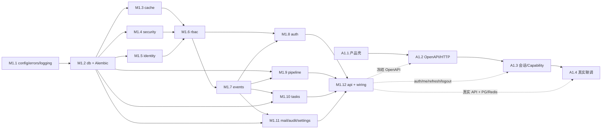

# M1 / A1 双轨执行计划

> 计划启动：2026-08-04（Asia/Shanghai）  
> 基线：M0 后端脚手架与 A0 管理员端模板基线已落库；依赖版本已冻结。  
> 本文是 M1/A1 的执行编排，不替代各组件规格；组件行为、登记项和数据边界仍以 `context/kernel/`、`context/admin/` 与 ADR 为准。

## 1. 目标与非目标

### 1.1 目标

- M1：交付可运行、可测试、可扩展的内核与 API 组合根。
- A1：将模板收敛为 aiya-cms 管理应用壳，并接入版本化 OpenAPI、会话、Capability 和真实健康检查。
- 双轨在以下真实链路汇合：

```text
管理员 SPA → /api/v1/auth/login → access/refresh
           → /api/v1/auth/me → capabilities
           → 受限 API / 页面守卫
           → refresh / logout
```

- 完成后，真实 PostgreSQL 链路通过；Redis、邮件和任务设施具备可验证的内核壳；管理员端不再依赖静默 mock。

### 1.2 非目标

- 不提前实现 M2 的 content、taxonomy、comment 业务页面和闭环。
- 不回滚或重新导入 A0 模板，不在 A1 同步上游模板。
- 不实现 OAuth、找回密码/邮箱验证、Meilisearch、多实例 Cron leader 选举等规格中明确延期的内容。
- 不让前端成为授权边界；后端 `require_capability` 始终是最终权威。

## 2. 执行原则

1. **文档先行**：新增行为先更新对应规格；架构取舍先写 ADR。
2. **测试先行**：每个批次先写接口、流程、边界测试，确认红后再实现。
3. **按依赖序实现**：禁止为了并行而跨越 kernel 依赖顺序。
4. **显式装配**：Pipeline、Event、Cron、Capability 和错误码全部登记后显式 wiring；禁止自动发现。
5. **契约单一事实来源**：后端 FastAPI OpenAPI 冻结后生成管理员端类型/客户端，生成物禁止手工编辑。
6. **真实链路优先**：mock 只能用于 A1.3 在 M1 未完成时的独立推进；A1.4 必须移除对应真实接口的 mock handler。

## 3. 依赖图与同步门



### 同步门

| 门 | 前置条件 | 产物 | 阻断规则 |
|---|---|---|---|
| G0 计划门 | 本文、各规格和未决 ADR 清单确认 | 执行批次与测试矩阵 | 未完成不得开始新增行为代码 |
| G1 M1 基础设施门 | config/errors/logging/db/cache/security 测试绿 | engine、Base、UoW、Cache、Principal 公开 API | 不得开始真实 auth 持久化 |
| G2 身份授权门 | identity/rbac 测试绿、Capability/错误码登记完整 | User、Role、Permission、Policy、seed | 不得冻结 auth/me 响应 |
| G3 认证契约门 | events/auth 测试绿，API DTO/错误模型冻结 | `/api/v1/auth/*` OpenAPI | A1 只能使用生成类型，不得手写 DTO |
| G4 管理壳门 | A1.1/A1.2/A1.3 mock 测试绿 | aiya-cms 壳、生成客户端、会话状态机 | 不得把 mock 当默认真实模式 |
| G5 真实联调门 | API wiring、PG/Redis、Playwright 全绿 | 登录→me→受限路由→refresh→logout | 未通过不得宣布 M1/A1 完成 |

## 4. M1 后端执行批次

### M1.0 规格、登记与测试矩阵

**先做：**

- 逐项核对 `context/kernel/*.md` 与公开 API、表、事件、Pipeline、Cron、错误码登记。
- 确定健康检查契约：保留基础 `/healthz`，并评估是否增加供管理员生成客户端调用的 `/api/v1/health`；决定后写入 API 规格或 ADR。
- 为认证令牌存储、CORS、CSRF、注销和 request id 传播补齐 ADR/规格；未决前不实现真实前端持久化策略。
- 建立测试目录镜像：`tests/kernel/<component>/`、`tests/api/`、`tests/integration/`，测试只锁定规格中已登记行为。

**退出条件：** 未决项有明确负责人和阻断批次；没有“先写实现再补登记”的任务。

### M1.1 基础配置、错误与日志

- 实现 `config` 的 settings 缓存、环境校验和测试覆盖。
- 实现 `errors` 的 `AppError`、错误码注册表、重复/未登记 fail-fast 和 FastAPI 响应模型。
- 实现结构化日志上下文，至少贯通 `request_id`、actor、route 和 error code。

**测试重点：** prod 禁用默认 JWT secret、错误码重复登记失败、错误响应字段稳定、request id 缺失时生成。

### M1.2 DB / UoW / Repository / Alembic

- 实现 async engine/session、`Base`、UUIDv7、UTC tz-aware 时间戳、JSONB `JsonBModel`、分页 DTO。
- 实现 UoW 与 Repository 基类；Service 不接收/导入 Session。
- 建立 identity/rbac/auth 需要的首轮迁移；迁移之外禁止裸 SQL。
- 补充架构守护：Service Session 红线、SQLAlchemy 2.0 风格、JSONB 对应 Pydantic Model、UUIDv7/timestamptz。

**测试重点：** commit/rollback、事务隔离、分页边界、JSONB 类型往返、迁移可重复执行。

### M1.3 Cache 与 M1.4 Security

- Cache：Memory/Redis 双实现、`get_or_set` 单飞、TTL、异常降级与内部日志。
- Security：Argon2 密码哈希、JWT access/refresh 编解码、过期/签名/类型校验、`Principal` 与匿名/系统 bot。

**实现状态（2026-08-04）：** M1.3 已交付 `Cache` Protocol、`MemoryCache`、`RedisCache`、同步工厂和 `aiya:` key 命名空间；Redis 操作异常会降级到同实例 MemoryCache。M1.4 Security 已交付 Argon2id 密码哈希、HS256 access token、opaque refresh token 摘要和 Principal/claims 校验；认证流程仍归 M1.8 Auth。

**测试重点：** 并发单飞只执行一次、Redis 不可用时按规格降级、密码不可逆、token 类型和过期严格校验。

### M1.5 Identity 与 M1.6 RBAC

- Identity：users、identities、organizations 占位模型与 DTO/Repository/Service；注册所需的用户状态机和唯一约束。
- RBAC：roles、permissions、关联表、Capability 别名 seed、Policy 纯函数、FastAPI `require_capability`。
- 先登记 `user:*`、`role:*`、`content:*`、`term:*`、`comment:*` 别名；A1 只消费已登记的 auth/me 能力字段。

**实现状态（2026-08-04）：** RBAC 已交付 roles/permissions/关联表及 `0003_rbac` 迁移、幂等 seed、Capability Registry、owner Policy、`CapabilityChecker`、`require_capability` 与 `RBACService`。关联表联合主键例外及缓存降级策略见 ADR-0019。

**测试重点：** 默认 reader 角色、用户禁用/删除状态、唯一冲突、匿名/系统 bot、owner policy、未登记 Capability 启动失败、批量用户查询无 N+1。

### M1.7 EventBus 与 M1.8 Auth

- EventBus：事件基类/登记、订阅、失败隔离、`wait_idle`、测试用 fresh bus。
- Auth：注册、登录、refresh rotation、logout/revoke、登录限频；按规格发布 `user.*` 事件。
- 认证 HTTP API 固定为 `context/kernel/auth.md` 中的 `/api/v1/auth/register|login|refresh|logout|me`，任何变更必须先改规格并重新生成 OpenAPI 客户端。

**实现状态（2026-08-04）：** M1.7 已交付 Pydantic `Event`、显式事件类型 Registry、EventBus wiring freeze、异步 handler 派发、单 handler 失败隔离、`wait_idle`、全局单例与 `fresh_event_bus`。M1.8 已交付 `AuthService`、`AuthUnitOfWork`、`refresh_tokens` 迁移、注册/登录/me/refresh/logout、刷新轮换与重放保护、登录限频和 `user.*` 事件；M1.9 已交付 `PipelineKey`、`PipelineDef`、`StepContext`、`PipelineRegistry`、`PipelineExecutor`、读写事务边界、提交后 after 隔离与启动校验；M1.10 已交付 `BaseTask`、`TaskScheduler`、`task_instances` 迁移、幂等启动、Cron 注册、orphan 回收、任务事件及 LISTEN/NOTIFY 唤醒边界；分别对应 ADR-0022/0023/0024，认证、Pipeline、Tasks 与 API 集成测试纳入全量 100 项；HTTP 路由与浏览器 Cookie 装配已由 M1.12/A1.3 完成。

**测试重点：** 注册→登录→me→refresh→logout；refresh 重放保护；旧 refresh 失效；匿名枚举防护；限频；封禁即刻吊销 token；事件 `wait_idle`。

### M1.9 Pipeline 与 M1.10 Tasks

- Pipeline：Registry、`StepContext`、before/core/after 执行顺序、读写 kind、启动 `validate_all`。
- Tasks：APScheduler 壳、`BaseTask` 状态机、Cron 注册表、stuck 扫描、LISTEN/NOTIFY 仅用于任务唤醒。
- 将所有 M2 预留 Pipeline key/槽位在规格中登记，但不提前实现 M2 业务 step。

**测试重点：** 重复/未登记 key、读 Pipeline 写 step 拒绝、commit 后 after step、step 失败隔离、Cron 幂等注册、orphan 任务、通知丢失时回表校验。

### M1.11 Mail / Audit / Settings

- Mail：SMTP 封装、mail outbox、失败重投 Cron。
- Audit：消费认证/RBAC/敏感操作事件，异步 append-only 落库，查询只读，清理 Cron 使用系统 bot。
- Settings：声明式 SettingGroup/SettingField 解释器、稀疏 JSONB 用户覆盖值、缓存读取与更新事件；GET 路径不产生业务副作用。

**测试重点：** outbox 状态机/重投、审计失败不阻塞业务事务、敏感操作必审计、查询只读、setting 未登记拒绝、缓存失效。

**实现状态（2026-08-06）：** 已交付 `mail_outbox`、`audit_logs`、`settings` 及 `0006_mail_audit_settings` 迁移；Mail SMTP/outbox 重投、Audit 异步 append-only/query/purge、Settings 声明式解释器/稀疏覆盖/cache/update event 已接入显式 wiring，对应 ADR-0025、ADR-0031。

### M1.12 API 组合根与 wiring

- app factory、版本化 router、依赖注入、全局异常处理、request_id 中间件、CORS 按环境配置。
- 显式 wiring：错误码、Capability、Event、Pipeline、Cron、模块占位全部注册并启动 fail-fast。
- 健康检查拆分为进程状态与依赖状态；GET 只读，Redis/PG 探针不得写业务表或发业务事件。
- 生成冻结 OpenAPI JSON，作为 A1.2 的输入；为集成测试提供可控的 test settings/fixtures。

**实现状态（2026-08-04）：** 已交付版本化 health/auth/users/settings/audit 路由、request ID/CORS/全局异常处理、Cookie refresh 策略、EventBus/Cron/Service 显式装配与启动生命周期；真实 PG 认证链路测试已落库。

**M1 完成条件：** 内核/架构/集成测试全绿；真实 PG 上认证链路通过；`ruff check`、`ruff format --check`、`mypy inc`、`pytest` 全绿。

## 5. A1 管理员端执行批次

### A1.0 A0 基线复核

- 从现有 `admin/package-lock.json` 开始，不再同步上游模板。
- 先修复/确认本机 npm launcher 与 Node 24 环境，使 `npm ci` 和四项质量门可执行。
- 将 Playwright 作为 A1.4 的新增质量门，记录浏览器版本与启动方式。

### A1.1 产品壳

- 产品名、favicon、title、默认 `zh-CN`、fallback 语言和文案统一为 aiya-cms。
- 清理商城/演示/赞助/上游发布路由；保留布局、表格、表单、图表和 MSW 基础设施。
- 按用户与权限、内容、taxonomy、评论、审计、设置、任务建立导航；A1 只实现壳和状态页，不实现 M2 业务 CRUD。
- 增加启动、默认语言、导航可见性、404/403 单测。

### A1.2 OpenAPI 与统一 HTTP

- 在 G0/G3 之间选定生成器并登记命令、版本、目录、更新规则；优先评估 `openapi-typescript` + 原生 `fetch` 适配，避免把 axios DTO 继续作为长期事实来源。
- 生成目录建议为 `admin/src/common/api/generated/`，生成文件只读。
- 统一 HTTP 层负责 base URL、超时/取消、request id、204、错误体解析与 `AppError(code,http_status,message,request_id)` 映射。
- 增加 OpenAPI 过期检查：后端 schema hash 或生成命令必须在质量门中可验证。
- 先接健康检查，再接 auth；不维护手写后端 DTO。

### A1.3 会话与 Capability

- 在 ADR 确定 access/refresh 的浏览器存储、CORS、CSRF、退出和多标签页策略。
- Pinia 只保存会话与纯客户端状态；`/auth/me` 是服务端用户/能力事实来源。
- 实现登录、me、刷新、退出、启动恢复；401 刷新单飞，原请求最多重放一次，失败后清理会话并跳转登录。
- 路由守卫/导航/操作按钮使用 capability；独立实现 401、403、404、服务不可用状态。
- MSW 与真实 API 复用同一生成类型，禁止 mock 响应漂移。

### A1.4 真实联调与验收

- `npm run dev` 默认请求 FastAPI；仅 `npm run dev:mock` 启用 MSW。
- 联调顺序：健康检查 → login → me → capability 受限路由 → refresh → logout → 401/403/422/429 错误展示。
- PostgreSQL/Redis 依赖状态在页面可见；健康检查不写业务数据。
- Playwright 覆盖桌面与移动视口；真实模式不注册 auth mock handler。
- 联调后重跑 `npm ci`、`npm run check`、`npm run typecheck`、`npm run test:unit`、`npm run build`、`npm audit`。

**A1 完成条件：** 品牌与导航完成；生成客户端/过期检查有效；mock 链路与真实链路都覆盖会话状态机；真实 FastAPI + PostgreSQL + Redis 链路和 Playwright 全绿。

## 6. 首轮提交顺序（建议）

每个提交保持单一职责，推荐顺序：

1. `docs: add m1-a1 execution plan`（本文及索引链接）
2. `test(kernel): lock config errors logging contracts`
3. `feat(kernel): add db uow repository primitives`
4. `feat(kernel): add cache and security primitives`
5. `feat(kernel): add identity and rbac`
6. `feat(kernel): add event bus and auth`
7. `feat(kernel): add pipeline and tasks shell`
8. `feat(kernel): add mail audit settings`
9. `feat(api): add app wiring health and auth routes`
10. `feat(admin): complete product shell and api client`
11. `feat(admin): add session capability guard`
12. `test(integration): verify m1 a1 real auth journey`

提交可按实际批次拆分，但不得把未通过的质量门隐藏在大提交中。

## 7. 初始阻塞项与风险

| 项目 | 当前观察 | 处理批次 |
|---|---|---|
| 后端 ruff 基线 | **已解决**（2026-08-04）：`alembic/versions/0001_m0_empty.py` I001 已修复，`ruff check .` 全绿 | M1.0 |
| 管理员 npm 执行器 | **已解决**（2026-08-04）：npm 12.0.2 / Node 24.18.1 下 `npm ci` 成功（292 包），vue-demi/msw/esbuild postinstall 已批准执行 | A1.0 |
| 健康检查路径 | **已决策**（ADR-0015）：保留 `/healthz`（存活探针）+ 新增 `/api/v1/health`（依赖状态，供生成客户端） | G0 ✅ |
| Token/CORS/CSRF | **已决策**（ADR-0013）：httpOnly Cookie refresh（SameSite=Strict）+ access 内存；CORS/CSRF/注销/多标签页策略已定 | G0 ✅ |
| request_id 传播 | **已决策**（ADR-0014）：前端 `X-Request-ID` 优先，服务端兜底 UUIDv7，401 重放沿用同一 id | G0 ✅ |
| OpenAPI 生成器 | **已登记**（2026-08-04）：openapi-typescript + 原生 fetch，目录 `admin/src/common/api/generated/`，详见 admin A1.2 | G0/G3 |
| codegraph | **已完成**（2026-08-04）：CodeGraph CLI 1.4.1 已在仓库执行 `init`/`sync`，索引 273 files / 2,475 nodes / 5,178 edges；`.codegraph/` 已加入 `.gitignore` | M0 ✅ |

## 8. 计划完成定义

- [x] 本文与 `context/README.md`、`context/roadmap.md`、`context/admin/01-a0-a1-plan.md` 互相链接且状态一致。
- [x] G0 未决 ADR（ADR-0013 令牌/CORS/CSRF、ADR-0014 request_id、ADR-0015 健康检查）、OpenAPI 生成方案均已登记。
- [x] M1 每个组件都有红/绿测试及对应架构守护，真实 PG 认证链路通过。
- [x] A1 生成客户端、统一错误、会话刷新、Capability 守卫和 Playwright 桌面/移动 mock 用例通过。
- [x] 管理员端 check/typecheck/unit/build 全绿，文档与实现已同步；真实 Docker 运行时联调留待 daemon 恢复后复跑。
