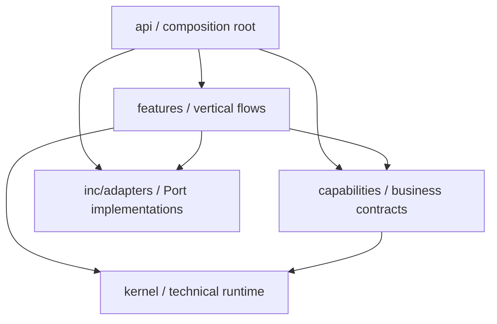

# 架构规格

## 1. 架构目标

系统采用“技术内核 + 业务能力 + 垂直功能 + 组合根”结构。目标是让新业务在 capability 或 feature 内完成，让 kernel 对业务词汇保持无知，并让所有运行行为都能从一个显式 manifest 追溯。

```text
inc/
  kernel/          技术运行机制
  capabilities/    独立业务能力
  features/        跨能力垂直业务流
  adapters/        外部 Port 实现库（按 capability 分目录，见 adapters.md）
  api/             唯一组合根和 HTTP 适配
admin/             OpenAPI 客户端
site/              Astro SSR 用户站（仅消费用户 OpenAPI）
```



依赖箭头只允许向下。`kernel` 不认识业务；capability 之间不存在横向代码依赖；feature 负责合法的跨能力、多步骤业务编排；API 只负责 HTTP/授权适配和显式组合，不成为业务服务仓库。adapter 与 capability/feature 同级是一等规格成员（`adapters.md`），由 manifest 按稳定 key 显式绑定；provider-valued Port 在启动时注册全部允许实现，运行时由 settings 的 ProviderCatalog/Resolver 选择当前 provider。capability 不得反向导入 adapter。

## 2. 术语

- **kernel**：不理解用户、内容、积分等业务含义的技术运行机制。
- **capability**：拥有自身业务规则、模型/表、语义原子操作（Command/Query/Activity）、事件和迁移的业务边界。
- **feature**：注册实际业务规格，或串联多个 capability 的跨能力、多步骤垂直业务流。
- **Port**：消费方声明的外部能力接口。
- **adapter**：组合根注册的 Port 实现；provider-valued Port 通过 catalog/resolver 选择当前实现。
- **Command/Query**：capability 公开的写/读入口。
- **workflow**：跨事务、可持久化、可恢复的业务流程。
- **activity**：workflow 中可单独执行、重试和幂等的步骤。
- **manifest**：本应用明确启用的 capability、feature、adapter、router 和 worker 清单。

## 3. 依赖矩阵

| 来源 | 允许依赖 | 禁止依赖 |
| --- | --- | --- |
| `kernel` | 标准库、批准的基础设施库、kernel 自身 | capabilities、features、api、具体业务模型 |
| 单个 capability | kernel、自身公开与内部模块 | 兄弟 capability、feature、api、兄弟表/ORM |
| feature | kernel、多个 capability 的公开面、Port 实现（`inc/adapters/`）、自身 | capability 内部实现、ORM、Repository、api |
| api | kernel、capability/feature 公开声明、Port 实现（`inc/adapters/`） | capability 私有实现、跨表业务逻辑和业务流程 |
| adapters | kernel、capability/feature 公开声明、自身 | 兄弟 capability 内部实现、业务表/ORM |
| admin | 生成的 OpenAPI 类型和 HTTP | Python 源码、手写后端 DTO、数据库 |
| site | 生成的用户 OpenAPI 类型和 HTTP/BFF session | Python 源码、管理端生成类型、数据库、provider secret |

架构测试必须基于 AST/import graph 验证本矩阵；包名约定不是人工自觉替代品。

## 4. 公开面与封装

- 每个 kernel 组件和 capability 只能从其包根或明确的 `public.py` 导出稳定公开面。
- ORM、Repository、UoW 实现、私有 registry 和 provider SDK adapter 默认是内部实现。
- 外部 provider adapter 集中在 `inc/adapters/<capability>/`，按 `adapters.md` 目录合同组织；capability 不持有 SDK，组合根按 manifest 显式选择实现。
- feature 只能持有 Command/Query gateway、Activity 或 Port；不得接收 Session。
- API handler 只能做协议解析、鉴权依赖、调用公开入口和响应映射，不实现领域规则。
- 不承诺旧 Demo 的 Python import path、表结构、端点或事件 key 兼容。
- `release_0001` 基线发布后，公开 DTO、事件 schema、迁移和 OpenAPI 按版本策略演进。

## 5. 数据所有权

- 每张业务表只能归属一个 capability；kernel 只拥有 outbox/inbox、workflow/task 等技术表。
- capability 不得建立指向兄弟 capability 表的数据库外键、ORM relationship、级联删除或跨表写事务。
- 跨能力主体使用 `(subject_type, subject_id)`、`(target_type, target_id)` 等 opaque reference。
- 创建或变更 opaque reference 时，由消费方 Port 校验目标是否存在和是否可用；读路径不为校验而写入。
- 跨能力报表使用 readmodel provider 或异步投影；API 不直接 join 多个 capability 的表。
- 同一 capability 内允许强外键、唯一约束和事务一致性。

这意味着 access、OIDC、points、payments 可引用 identity subject，但不拥有 `users` 外键；taxonomy 可关联 content target，但不导入 content 模型。

## 6. 事务与副作用

- 单个 Command 只修改其所属 capability 的表和 kernel outbox；事务通过该 capability 的 UoW 提交。
- 同步跨能力流程由 feature 顺序调用公开 Command/Activity；不得伪装成跨能力单事务。
- 异步跨能力写入使用 outbox -> dispatcher -> inbox/idempotent handler。
- 业务事件只描述已经提交的事实，不用于请求另一个能力参与当前事务。
- 读路径不得写数据库、增加计数、发送事件、连接外部 provider 或刷新缓存状态。
- 外部 SDK 调用必须位于 activity/adapter 中，不得发生在尚未提交且长期持锁的数据库事务中。
- 不可逆副作用失败时由 workflow 重试或人工恢复，不回滚已提交的真实业务事实。

## 7. 抽象原则

- kernel 只抽象两个以上业务能力共同需要且不带业务词汇的机制。
- 第二个真实用例出现前，不为猜测中的扩展点建立基类或插件协议。
- 优先 Protocol、组合、小型 Command/Activity；禁止以深层继承表达邮件类型、任务类型或业务流程。
- Repository/UoW 可以通用，业务 Service/Command 不得退化为表 CRUD；capability 的每个原子 Command 在自身 UoW 内维护自身事实与 kernel outbox，跨能力效果只能经过已声明的公开 Command、Activity 或 Port，不能访问兄弟表。
- `content`、`access`、`membership` 等 capability 自己负责规则和原子操作；跨能力、多步骤工作由 feature 顺序调用公开面，不把流程塞回 capability 或 API。
- `/api/v1/admin/**` 的普通管理 CRUD 直接适配所属 capability 的公开 Command/Query，不为形式统一额外包 feature；只有跨能力流程才注册 feature gateway。
- feature 的“单文件完整业务流”是编排和规则集中，不是把 ORM、HTTP 和 SDK 复制到同一文件。
- `user_center` 统一编排签到、积分/会员购买、礼品卡兑换与会员周期积分桶；`business_center` 统一编排“受信报价 -> points 扣费 -> 业务履约”。前者负责价值取得和账户视图，后者负责价值消费。
- 系统内业务消费只使用 points 的固定 `credit` program。现实法币订单、attempt、webhook、退款及未来法币余额全部闭合在 payments；其他能力只经 feature 请求 payment 结果，不持有法币订单表。

## 8. 注册和运行时边界

- 所有注册为纯数据声明，import 不得修改全局状态。
- 包根 `__init__.py` 只导出公开声明或稳定公开面；不得注册能力、连接数据库、启动线程/协程或创建可变全局单例。
- registry 属于应用 container，完成 validate/freeze 后不可变。
- provider-valued Port 的全部允许实现由组合根在启动时注册到 ProviderCatalog；settings 只保存当前选择，Resolver 在实际调用时解析该 provider。启动不得按配置顺序探测或连接外部服务。
- 未在 manifest 启用的项目不得注册路由、订阅、Cron、worker 或外部连接。
- 所有随当前发行版交付的表由迁移统一创建；数据库中存在表不代表 capability 已启用。
- 重复 key、未知依赖、Port 未绑定、事件 schema 冲突、任务版本缺失和权限未登记必须阻止启动。

详细生命周期见 `composition.md`。

## 9. OpenAPI 投影与客户端边界

`openapi.json` 只作为 release manifest 的完整系统验证快照，且可在等价验证存在后停止生产，不是生产客户端合同。组合根从同一完整 schema 显式生成两个投影：`openapi.admin.json` 承载全部 `/api/v1/admin/**` 路由以及管理员壳层需要的 health/session/OIDC 协议面；`openapi.user.json` 承载公开内容、认证、`/api/v1/me`、user_center 和 business_center。管理员 SPA 只能从 admin 投影生成类型，用户站只能从 user 投影生成类型。投影必须保持 `$ref` 与 security scheme 闭包、稳定排序并删除不可达 components；快照及 hash 由 `openapi-check` 校验。

## 10. 基础数据约定

- 主键默认 UUIDv7；时间使用 UTC、tz-aware `timestamptz`。
- 枚举持久化为稳定字符串，不持久化 Python 枚举序号。
- JSON 使用 PostgreSQL JSONB，并绑定明确 Pydantic 模型和 schema version。
- 金额使用最小货币单位整数；积分使用整数，禁止浮点数。
- 所有列表查询必须有确定性最终排序键，通常以 `id` 收尾。
- 公开资源的物理删除必须由所属 capability 明确规定；默认归档优先。

## 11. 下一用户站能力范围

下一用户站 `release` 目标包含 identity、access、oidc_provider、audit、settings、assets、archive、content、comments、taxonomy、community、notification、payments、points、membership、gift_cards、engagement capabilities，以及 `auth`、`user_center`、`business_center`、`site_settings`、`site_cleanup`、`post`、`page`、`work`、`content_bucket` features。注册、验证和密码找回归 auth；账户取得价值归 user_center；系统内积分消费与业务履约归 business_center；图床上传/处理归 content_bucket。community 直接拥有 discussion/post/tag/search 产品面，不借用 content/taxonomy/comments 表。只有 `release` 为可部署 manifest；未装配声明不得产生路由、worker、Cron 或外部连接。

`gift_cards` 负责单 secret 礼品卡的发行、预留和核销事实；user_center 组合兑换 membership 或 points。archive 负责外部托管 locator、下载授权和短时交付；business_center 组合 points 扣费与 archive 履约。assets 继续只负责图片/普通对象存储稳定引用，不扩张为计费下载能力。

跨领域/全站搜索、通用 commerce 商品平台、通用 webhook 平台和 WordPress 兼容不在本闭环。固定文件清单积分下载是 business_center 的首个产品；未来 AI 写作或其他 OIDC 客户端应注册独立 product/pricing/fulfillment 合同，不把业务模型塞进 points。community capability 自有的 discussion 搜索是其领域读模型，不构成 kernel 或全站搜索平台。

## 12. 架构验收

- kernel 源码中不存在具体业务模型或对上层的 import。
- capability 之间无 import、ORM relationship、数据库外键或直接表访问。
- 空 manifest 启动时无业务路由、事件订阅、Cron、worker 和外部连接。
- 最小 manifest 只激活声明项，未声明 router 返回 404。
- Service/handler 边界无 Session；无裸 SQL；所有 JSONB 有模型。
- 读路径副作用测试通过。
- 所有注册项能输出确定性清单，并在重复/缺失时 fail-fast。
- API、迁移、事件和管理员生成类型能追溯到所属规格。
- membership 不导入或通过 Port 调用 points；会员周期积分由 user_center 持久 workflow 编排。
- business_center 只调用公开 pricing、points 与 fulfillment 合同，不访问业务 capability 的 ORM/Repository。
- archive provider locator、token、secret headers 和短时 URL 不进入 content JSONB 或客户端 OpenAPI。
